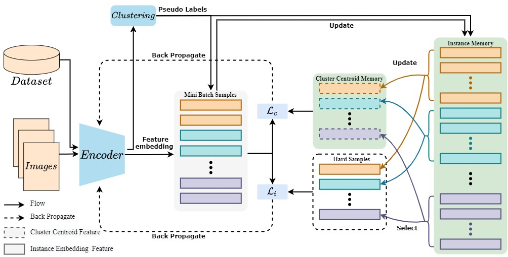

# HHCL-ReID
[](https://twitter.com/intent/tweet?text=Codes%20for%20Our%20Paper:%20"Hard-sample%20Guided%20Hybrid%20Contrast%20Learning%20for%20Unsupervised%20PersonRe-Identification"%20&url=https://github.com/bupt-ai-cz/HHCL-ReID) 

This repository is the official implementation of our paper "[Hard-sample Guided Hybrid Contrast Learning for Unsupervised Person Re-Identification](https://arxiv.org/abs/2109.12333)!".  



## Requirements

---

    git clone https://github.com/bupt-ai-cz/HHCL-ReID.git
    cd HHCL-ReID
    pip install -r requirements.txt
    python setup.py develop

## Prepare Datasets

---

Download the datasets Market-1501,MSMT17,DukeMTMC-reID from this [link](https://drive.google.com/file/d/19oWiYGjTgouFMK_psZvH8ysDGQ1KUbk-/view?usp=sharing) and unzip them under the directory like:

    HHCL-ReID/examples/data
    ├── market1501
    │   └── Market-1501-v15.09.15
    └── dukemtmcreid
        └── DukeMTMC-reID

Prepare ImageNet Pre-trained Models for IBN-Net

When training with the backbone of [IBN-ResNet](https://arxiv.org/abs/1807.09441), you need to download the ImageNet-pretrained model from this [link](https://drive.google.com/drive/folders/1thS2B8UOSBi_cJX6zRy6YYRwz_nVFI_S) and save it under the path of `examples/pretrained/`.

```
HHCL-ReID/examples
└── pretrained
    └── resnet50_ibn_a.pth.tar
```

## Training

---

We utilize 4 GTX-2080TI GPUs for training. Examples:

Market-1501:

    CUDA_VISIBLE_DEVICES=0,1,2,3 python examples/train.py -b 256 -a resnet50 -d market1501 --iters 200 --eps 0.45 --momentum 0.1 --num-instances 16 --pooling-type avg --memorybank CMhybird --epochs 60 --logs-dir examples/logs/market1501/resnet50_avg_cmhybird
    

DukeMTMC-reID:

    
    CUDA_VISIBLE_DEVICES=0,1,2,3 python examples/train.py -b 256 -a resnet50 -d dukemtmcreid --iters 200 --eps 0.6 --momentum 0.1 --num-instances 16 --pooling-type avg --memorybank CMhybird --epochs 60 --logs-dir examples/logs/dukemtmcreid/resnet50_avg_cmhybird

- use `-a resnet50` (default) for the backbone of ResNet-50, and `-a resnet_ibn50a` for the backbone of IBN-ResNet;
- use `--pooling-type gem` for Generalized Mean Pooling (GEM) pooling and `--smooth` for label smoothing. 

## Evaluation

---

To evaluate my model on ImageNet, run:

    CUDA_VISIBLE_DEVICES=0 python examples/test.py -d $DATASET --resume $PATH --pooling-type avg

## Results

---

Our model achieves the following performance on :

| Dataset            | Market1501 |      |      |      | DukeMTMC-reID |      |      |      |
| ------------------ | ---------- | ---- | ---- | ---- | ------------- | ---- | ---- | ---- |
| Setting            | mAP        | R1   | R5   | R10  | mAP           | R1   | R5   | R10  |
| Fully Unsupervised | 84.2       | 93.4 | 97.7 | 98.5 | 73.3          | 85.1 | 92.4 | 94.6 |
| Supervised         | 87.2       | 94.6 | 98.5 | 99.1 | 80.0          | 89.8 | 95.2 | 96.7 |

You can download the above models in the paper from [[Google Drive\]](https://drive.google.com/drive/folders/1ryx-fPGjrexwm9ZP9QO3Qk4SKzNqbaXw?usp=sharing) 

## Citation

---

If you find this code useful for your research, please cite our paper

```
@article{hu2021hard,
  title={Hard-sample Guided Hybrid Contrast Learning for Unsupervised Person Re-Identification},
  author={Hu, Zheng and Zhu, Chuang and He, Gang},
  journal={arXiv preprint arXiv:2109.12333},
  year={2021}
}
```

## Acknowledgements

---

This project is not possible without multiple great opensourced codebases. We list them below.

- [SpCL](https://github.com/yxgeee/SpCL)
- [cluster-contrast-reid](https://github.com/alibaba/cluster-contrast-reid)
